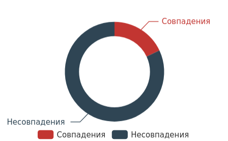

<center><h1><b><font face="sans-serif">Методология построения круговой диаграммы</font></b></h1></center>

---
Для построения круговой диаграммы используется сравнение 17 правовых признаков. Для анализа алгоритм сравнивает данные признаки по выбранным странам. Например, если мы выберем для сравнения Австрию и Белоруссию, то алгоритм автоматически построит таблицу, где первые 7 столбцов будут выглядть следующим образом:  

|       |  Деление на типы токенов | Майнинг регулируется| Название (утилити)| Название (криптовалюта) | Название (токен-актив) | Прим. законодательства о ЦБ|Правовой статус криптовалюты| 
|-|-|-|-|-|-|-|-|
|<b>Австрия</b>| да | нет | утилити токены | платежные токены | токены ценные бумаги |не определено|нематериальное имущество|
|<b> Белоруссия </b> |нет | да|  цифровые знаки (токены)| криптовалюта| цифровые знаки (токены)| нет| средство обмена|


### Полный список анализируемых признаков включает:
<p>
```
1. Деление на типы токенов
2. Майнинг регулируется
3. Название (утилити)
4. Название (криптовалюта)
5. Название (токен-актив)
6. Прим. законодательства о ЦБ
7. Правовой статус криптовалюты
8. Правовой статус (утилити-токены)
9. Правовой статус (токен-актив)
10. Регистрация криптобирж
11. Ограничение на инвестирование в утилити токены
12. Ограничение на инвестирование в токены активы
13. Способы инвестирования (утилити-токены)               
14. Способы инвестирования (токены-активы)       
15. Свободный оборот криптовалюты
16. Основной регулятор
17. Применение закона об электронных деньгах
```
</p>

Используя таблицу с указанными выше признаками, алгоритм сравнивает количество совпадений и несовпадений. Затем строится круговая диаграмма,  где цветом выделяется соотношение в процентах между количеством совпадений и количеством не совпадений.
К примеру, если мы выберем Австрию и Белоруссию, то будет построена следующая диаграмма с 18% совпадений и 82% не совпадений, как показано на диаграмме ниже.

<center>

</center>

       