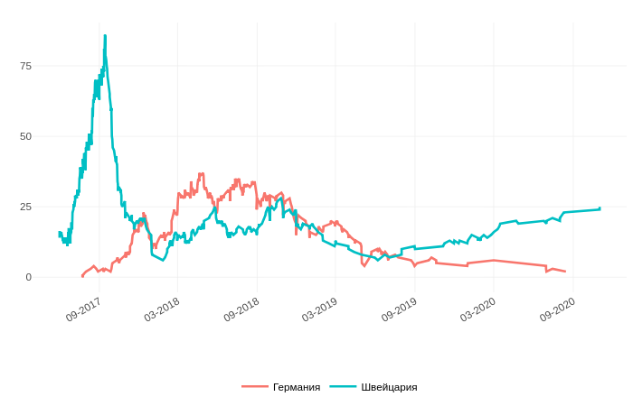

<center><h1><b><font face="sans-serif">Методология построения временной диаграммы</font></b></h1></center>

---
Информация о количестве ICO проектов, зарегистрированных в различных государствах была взята с 3 агрегаторов, предоставляющих такую информацию. <span style="background-color: #adff2f">Учитывались ICO проекты независимо от типа выпускаемого токена.</span> После сбора такой информации, алгоритм автоматически обрабатывает данные о проектах и строит соответствующие диаграммы. Если информация  о количестве ICO проектов в том или ином государстве оказалась недоступна, то в окне, где должен был быть посроен график Вы увидите ошибку. Это означает, что в одном или нескольких из выбранных государств вообще отсутствуют ICO проекты или информация о них не была опубликована на соответствующих агрегаторах ICO. 
```
Для удобства чтения диаграммы рекомендуется выбирать не более 2-3 государств одновременно. 
```
Для примера, если мы выберем Германию и Швейцарию, то алгоритм построит следующую диаграмму:

<center>

</center>