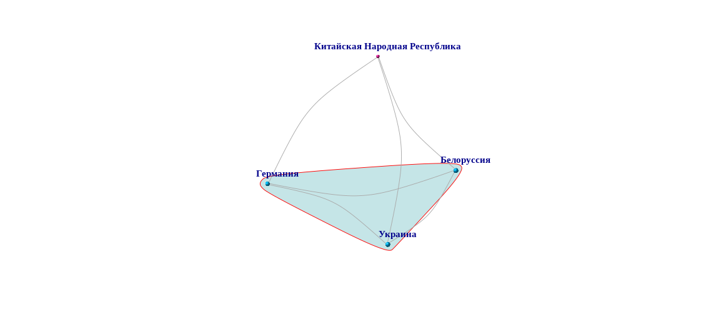

<center><h1><b><font face="sans-serif">Методология построения графов</font></b></h1></center>

---
Для построения графов по всем представленным странам была собрана общая информация о правовом регулировании оборота цифровых активов. На этой основе мы можем сравнить все государства друг с другом.  Например, при сравнении 4 государств, получится следующая таблица, где на пересечении строк и столбцов указано количество правовых признаков, которые совпали в двух государствах.


 Страны |  Китай  | Германия| Украина| Белоруссия 
| ------| -------| ------- | ------- | ------- | 
|<b> Китай </b> | 23      | 2       | 2       |  3
| ------ |
|<b>Германия</b>| 2      |23        |   8       |7     
| ------ |
| <b>Украина</b>| 2      | 8        | 23        |10   
| ------ |
| <b>Белоруссия</b>| 3    |   7   | 10       |  23  

<p>
```
Заметим, что на пересечении столбцов и строк одной и той же страны всегда 23. Так происходит потому что страны сравнивались по 23 показателям
```
</p>
   <p>
  Далее находится среднее арифметическое совпадающих значений по выбранным странам по формуле <span style="background-color: #adff2f">A = s/n</span> где <span style="background-color: #adff2f">s</span> - сумма всех значений, <span style="background-color: #adff2f">n</span> - количество значений. Для приведённой выше таблицы <span style="background-color: #adff2f">s=148</span>, а <span style="background-color: #adff2f">n=16</span>. Тогда <span style="background-color: #adff2f">s=148</span>. <span style="background-color: #adff2f">A</span> для данной таблицы будет <span style="background-color: #adff2f">9.75</span>
 </p>
 <p>
 ```
  Переменная A выражает общее усреднённое представление о правовом режиме цифровых активов в данной подвыборке стран.
```
</p>
<p>
Далее находится среднее количество совпадений, но уже по каждой стране. Для указанной выше таблицы, среднее количество совпадений для Белоруссии будет <span style="background-color: #adff2f">(3+5+10+23)/4 = 10.75</span>. Поскольку данный показатель превышает <span style="background-color: #adff2f">A</span>, считам, что Белоруссия соответствует общему представлению правовом регулировании цифровых активов среди выбранных стран. 
Напротив, для Китая этот показатель составляет <span style="background-color: #adff2f">7.5</span>, что меньше среднего количества совпадений по сей выборке стран. Поэтому считаем, что Китай не соответствует общему усреднённому тренду правового регулирования в данной подвыборке стран.
  </p>
____
Следуя данному алгоритму, строятся графы, где бирюзовым цветом обводятся те страны, среднее количество совпадений по которым больше <span style="background-color: #adff2f">А</span>. Таким образом мы получаем кластер стран с одинаковым усреднённым правовым регулированием в данной выборке государств.
Для выбранных в таблице государств, графы выглядят следующим образом:



```
Размер точек зависит от количества совпадений конкретной страны со всеми остальными государствами. Так малый размер точки Китая на графах выше означает, что совпадений между правовым регулированием Китая и остальных указанных государств очень мало. 
```


